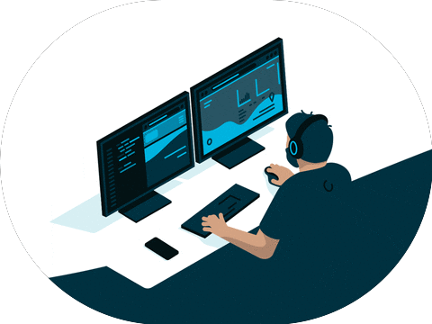

  

___

 

My name is Hugo and I am a fullstack developer. I come from France and live in Melun. 🏙️

Build websites and web applications, ensure security, deployment.

Interest in cybersecurity and performance and data protection 🔒

Always willing to learn, I'm organized and detailed-oriented.

Love learning, code review, pair programming 👥

___

|Specialization|TECHNO|
|--|--|
|**BACK END** 🔙🔚|
||🍪 Cookies & Session
||🔐 Security encrypt datas 
||✉️ SMTP 
||🎢 FTP server - Filezilla
|**FRONT END**|---|
||🎨 HTML/CSS
||🎇 JAVASCRIPT
||🎀 CSS Bootstrap 
||🎏 ReactJS (beginner)
|**VERSIONING**|---|
||🐱‍👤 Git / GitHub 
|**DATABASE**|---|
||💼 SQL
||🗝 Ensure data security // Domains check value
|**ARCHITECTURE**|---|
||🎞 Models Views Controllers (MVC)
||♾ API RESTful
|**PROGRAMMING**|---|
||🕹OOP (Object Oriented Programming)
|**METHOD**|---|
||💢 Agile (Scrum)
|**CMS**|---|
||🎫 WordPress
|**DOCUMENTATION**|---|
||🎊 JSdocs with SwaggerDocs

Sources :

* [Badges](https://shields.io/category/build)
* [Contributions](https://github.com/DenverCoder1/github-readme-streak-stats)

